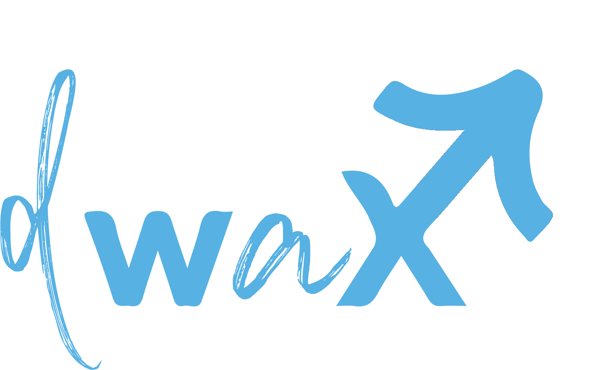

<!-- ══════════════════════ BANNER ══════════════════════ -->
<p align="center">
  
</p>

<!-- ══════════════════════ TYPING ══════════════════════ -->
<p align="center">
  <a href="https://github.com/dwaXGamer">
    
  </a>
</p>

<!-- ══════════════════════ BADGES ══════════════════════ -->
<p align="center">
  
  
  
</p>

<br/>

<!-- ══════════════════════ WHOAMI ══════════════════════ -->


> I'm **Dwayne Mhlanga** — known online as **dwaX**. I came up through **IT support**, and now I'm moving into **cybersecurity**, focused on **blue teaming and cloud security**. I spent my support years fixing what was broken; now I'm learning to spot what's weak *before* someone else does.

```yaml
name:      Dwayne Mhlanga (dwaX)
role:      Cybersecurity Student · Aspiring Blue Teamer
studying:  BSc Cybersecurity & Forensic Auditing @ UZ
from:      IT Support  →  Blue Team + Cloud Security
building:  CipherNest — my own SIEM, learning detection from the inside out
location:  Harare, Zimbabwe  (open to remote & internships)
offclock:  chess · design · anything security-related
```

<br/>

<!-- ══════════════════════ PROJECTS ══════════════════════ -->


<table>
  <tr>
    <td width="50%" valign="top">
      <h3>🛡️ CipherNest</h3>
      <p>A <b>SIEM</b> built from scratch — log ingestion, correlation rules & alerting. Made to <i>understand</i> detection, not just use it.</p>
      <p>
        
        
        
      </p>
      <a href="https://github.com/dwaXGamer">→ view repo</a>
    </td>
    <td width="50%" valign="top">
      <h3>🌐 dwaX Portfolio</h3>
      <p>My terminal-themed portfolio — interactive shell, project showcase & blog. <b>Vanilla HTML/CSS/JS</b>, no framework, no build step.</p>
      <p>
        
        
        
      </p>
      <a href="https://github.com/dwaXGamer/dwayne-mhlanga-portfolio">→ view repo</a>
    </td>
  </tr>
</table>

<br/>

<!-- ══════════════════════ ARSENAL ══════════════════════ -->


<p>
  
</p>

<p>
  <b>🔐 Security:</b>&nbsp;
  
  
  
  
  
</p>
<p>
  <b>☁️ Learning:</b>&nbsp;
  
  
  
</p>

<br/>

<!-- ══════════════════════ ROADMAP ══════════════════════ -->


<!-- EDIT THESE — swap in your real goals -->
```diff
+ [ ] Ship CipherNest v1 and write it up
+ [ ] Earn a blue-team / cloud cert (BTL1, Security+, or AWS)
+ [ ] Publish regular write-ups on the blog
+ [ ] Land a cybersecurity job
```

<br/>

<!-- ══════════════════════ STATS ══════════════════════ -->


<p align="center">
  
</p>
<p align="center">
  
  
</p>

<br/>

<!-- ══════════════════════ CONNECT ══════════════════════ -->


<p align="center">
  <a href="https://www.linkedin.com/in/dwayne-mhlanga-27b34614a/"></a>
  <a href="mailto:dwaynemhlangaa10@gmail.com"></a>
  <a href="https://www.instagram.com/dwax_the_geek/"></a>
  <a href="https://github.com/dwaXGamer"></a>
</p>

<p align="center">
  
</p>

<p align="center">
  <i>Built with purpose · Harare, Zimbabwe · 2026</i>
</p>
